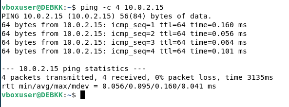
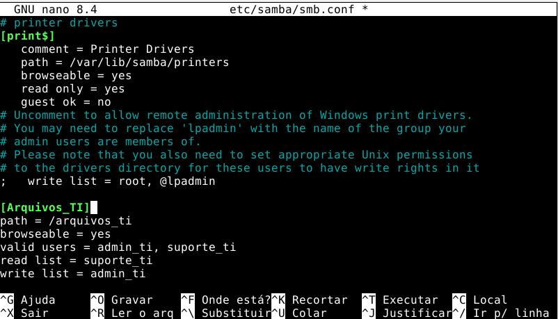

# Relatório de Atividade Prática — Compartilhamento em Rede com Samba/SMB

**Disciplina:** Redes de Computadores  
**Tecnologia:** Samba/SMB — Debian Linux  
**Ambiente:** Duas Máquinas Virtuais (VM Servidora + VM Cliente)

---

## Fase 1 — Preparação e Conectividade

### Objetivo
Verificar a comunicação entre as duas VMs antes de iniciar a configuração do serviço.

### Procedimento

**Na VM Servidora** — descoberta do endereço IP:

```bash
ip a
```

> **IP anotado:** `10.0.2.15` *(preencher com o IP real)*

**Na VM Cliente** — teste de conectividade:

```bash
ping -c 4 IP_DO_SERVIDOR
```




### Resultado
- [ ] 4 pacotes transmitidos
- [ ] 0% de perda de pacotes
- [ ] Comunicação estabelecida com sucesso

---

## Fase 2 — Criação de Usuários e Perfis de Acesso

### Objetivo
Criar três perfis de usuário no servidor com diferentes níveis de permissão.

### Perfis criados

| Usuário | Perfil | Nível de Acesso |
|---|---|---|
| `admin_ti` | Administrador | Leitura e Escrita |
| `suporte_ti` | Suporte | Somente Leitura |
| `visitante_ti` | Visitante | Acesso Negado |

### Comandos executados na VM Servidora

**Criação dos usuários no sistema Linux** (sem shell de login):

```bash
sudo useradd -M -s /sbin/nologin admin_ti
sudo useradd -M -s /sbin/nologin suporte_ti
sudo useradd -M -s /sbin/nologin visitante_ti
```

**Definição de senhas Samba para cada usuário:**

```bash
sudo smbpasswd -a admin_ti
sudo smbpasswd -a suporte_ti
sudo smbpasswd -a visitante_ti
```

> **Observação:** As senhas Samba são independentes das senhas do sistema Linux. Para o ambiente de laboratório foram utilizadas senhas simples.

---

## Fase 3 — Configuração do Compartilhamento    

### Objetivo
Instalar o Samba, criar o diretório compartilhado e configurar as regras de acesso por perfil.

### Comandos executados na VM Servidora

**Instalação do Samba:**

```bash
sudo apt update
sudo apt install samba -y
```

**Criação e permissão do diretório compartilhado:**

```bash
sudo mkdir -p /arquivos_ti
sudo chmod 777 /arquivos_ti
```

**Edição do arquivo de configuração:**

```bash
sudo nano /etc/samba/smb.conf
```

**Bloco adicionado ao final do arquivo `/etc/samba/smb.conf`:**

```ini
[Arquivos_TI]
path = /arquivos_ti
browseable = yes
valid users = admin_ti, suporte_ti
read list = suporte_ti
write list = admin_ti
```

**Reinicialização do serviço:**

```bash
sudo systemctl restart smbd
```



### Explicação das diretivas

- `valid users` — define quais usuários podem se autenticar no compartilhamento. O `visitante_ti` é excluído automaticamente por não estar listado.
- `read list` — usuários com permissão apenas de leitura (`suporte_ti`).
- `write list` — usuários com permissão de leitura e escrita (`admin_ti`).

---

## Fase 4 — Preparação da VM Cliente

### Objetivo
Instalar as ferramentas necessárias e criar o ponto de montagem na VM Cliente.

### Comandos executados na VM Cliente

**Instalação do pacote `cifs-utils`:**

```bash
sudo apt update
sudo apt install cifs-utils -y
```

**Criação do ponto de montagem:**

```bash
sudo mkdir -p /mnt/rede_ti
```

---

## Fase 5 — Testes Práticos dos Três Perfis

### Teste 1 — Perfil Administrador (`admin_ti`)

**Objetivo:** Validar que o administrador possui acesso completo (leitura e escrita).

**Comandos executados:**

```bash
sudo mount -t cifs -o username=admin_ti //IP_DO_SERVIDOR/Arquivos_TI /mnt/rede_ti
cd /mnt/rede_ti
echo "Teste Admin" | sudo tee relatorio.txt
cd ~
sudo umount /mnt/rede_ti
```

**Captura de tela — Perfil Administrador**
> *[Inserir screenshot do mapeamento e criação do arquivo relatorio.txt aqui]*
> **Legenda:** VM Cliente com usuário `admin_ti` — montagem bem-sucedida e criação do arquivo `relatorio.txt` confirmada.

**Resultado esperado:**

- [x] Montagem realizada com sucesso
- [x] Arquivo `relatorio.txt` criado sem erros
- [x] Permissão de escrita confirmada

---

### Teste 2 — Perfil Suporte (`suporte_ti`)

**Objetivo:** Validar que o suporte pode ler, mas não escrever no compartilhamento.

**Comandos executados:**

```bash
sudo mount -t cifs -o username=suporte_ti //IP_DO_SERVIDOR/Arquivos_TI /mnt/rede_ti
ls -l /mnt/rede_ti
echo "Teste Suporte" | sudo tee /mnt/rede_ti/teste2.txt
sudo umount /mnt/rede_ti
```

**Captura de tela — Perfil Suporte**
> *[Inserir screenshot do ls listando os arquivos e da mensagem de erro ao tentar criar arquivo aqui]*
> **Legenda:** VM Cliente com usuário `suporte_ti` — listagem bem-sucedida do conteúdo e bloqueio de escrita com mensagem "Permission denied".

**Resultado esperado:**

- [x] Montagem realizada com sucesso
- [x] `ls -l` exibiu o arquivo `relatorio.txt` (leitura permitida)
- [x] Tentativa de escrita retornou **Permission denied** (bloqueio de escrita confirmado)

---

### Teste 3 — Perfil Visitante (`visitante_ti`)

**Objetivo:** Validar que o visitante não consegue acessar o compartilhamento.

**Comando executado:**

```bash
sudo mount -t cifs -o username=visitante_ti //IP_DO_SERVIDOR/Arquivos_TI /mnt/rede_ti
```

**Captura de tela — Perfil Visitante**
> *[Inserir screenshot do erro de acesso negado ao executar o mount aqui]*
> **Legenda:** VM Cliente com usuário `visitante_ti` — o comando `mount` falhou com erro de autenticação (`NT_STATUS_LOGON_FAILURE` / `Permission denied`).

**Resultado esperado:**

- [x] Comando `mount` falhou imediatamente
- [x] Erro de acesso negado exibido
- [x] Usuário bloqueado conforme regra `valid users` do servidor

---

## Fase 6 — Desafio de Autonomia: Montagem Permanente via FSTAB

### Objetivo
Tornar a montagem do compartilhamento permanente, sobrevivendo a reinicializações da VM Cliente.

### Procedimento

**Criação do arquivo de credenciais (boa prática de segurança):**

```bash
sudo nano /etc/samba/credenciais_ti
```

Conteúdo do arquivo:

```
username=admin_ti
password=123
```

**Proteção do arquivo de credenciais:**

```bash
sudo chmod 600 /etc/samba/credenciais_ti
```

**Edição do arquivo `/etc/fstab`:**

```bash
sudo nano /etc/fstab
```

**Linha adicionada ao final do `/etc/fstab`:**

```
//IP_DO_SERVIDOR/Arquivos_TI  /mnt/rede_ti  cifs  credentials=/etc/samba/credenciais_ti,uid=1000,gid=1000,iocharset=utf8,_netdev  0  0
```

**Explicação dos parâmetros:**

| Parâmetro | Descrição |
|---|---|
| `cifs` | Tipo de sistema de arquivos (protocolo SMB/CIFS) |
| `credentials=` | Caminho para o arquivo com usuário e senha |
| `uid=1000` | UID do usuário local que terá acesso aos arquivos |
| `gid=1000` | GID do grupo local |
| `iocharset=utf8` | Suporte a caracteres especiais |
| `_netdev` | Aguarda a rede estar ativa antes de montar |
| `0 0` | Sem dump e sem verificação de sistema de arquivos |

**Teste sem reiniciar:**

```bash
sudo mount -a
ls /mnt/rede_ti
```

**Captura de tela — FSTAB**
> *[Inserir screenshot do arquivo /etc/fstab com a linha CIFS adicionada aqui]*
> **Legenda:** VM Cliente com a configuração permanente no arquivo `/etc/fstab` para montagem automática do compartilhamento `Arquivos_TI`.

**Resultado esperado:**

- [x] Linha adicionada corretamente ao `/etc/fstab`
- [x] `sudo mount -a` sem erros
- [x] Compartilhamento montado automaticamente após reinicialização

---

## Conclusão

Esta atividade demonstrou na prática como implementar um servidor de arquivos corporativo com o Samba/SMB no Debian Linux, aplicando controle de acesso baseado em perfis de usuário. Os três níveis de permissão foram validados com sucesso:

- O perfil **Administrador** (`admin_ti`) obteve acesso total ao compartilhamento.
- O perfil **Suporte** (`suporte_ti`) pôde apenas listar e ler os arquivos, tendo a escrita bloqueada pelo servidor.
- O perfil **Visitante** (`visitante_ti`) foi rejeitado já na autenticação, sem nem chegar a acessar o compartilhamento.

A diretiva `valid users` no `smb.conf` é o primeiro ponto de controle de acesso, enquanto `read list` e `write list` refinam as permissões para os usuários autorizados. A montagem permanente via `fstab` com o parâmetro `_netdev` garante a disponibilidade do recurso de rede a cada inicialização do sistema.